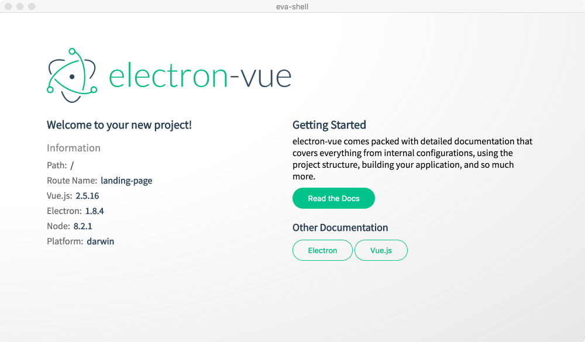

# eva-shell

> Electron Vue App (Eva) Shell. A \"Hello World\" of using VueJS & ElectronJS to build a cross-platform application shell.

#### Build Setup

``` bash
# install dependencies
npm install

# serve with hot reload at localhost:9080
npm run dev

# build electron application for production
npm run build

# run unit & end-to-end tests
npm test


# lint all JS/Vue component files in `src/`
npm run lint

```

## Long Form Birth Certificate

> This section contains step by step of how the Eva shell came to be (as its being built).  See doc link above for more user-friendly documentation and descriptions.

### Chef's Choice (お任せ)
  1. [vue-cli](https://github.com/vuejs/vue-cli)
  1. [electron-vue](https://github.com/SimulatedGREG/electron-vue)
  1. [Bulma](https://www.npmjs.com/package/bulma)


### In the beginning ...
This project was generated with [electron-vue](https://github.com/SimulatedGREG/electron-vue) using [vue-cli](https://github.com/vuejs/vue-cli). Documentation about the original structure can be found [here](https://simulatedgreg.gitbooks.io/electron-vue/content/index.html).

It is presumed that **NodeJS** is installed already.  Then from command prompt:

```
# Install vue-cli and scaffold boilerplate
npm install -g vue-cli
vue init simulatedgreg/electron-vue my-project
```

Following are the settings used when generating the project scaffolding:

>**Application Name** eva-shell
>
>**Project description** Electron Vue App (Eva) Shell. A "Hello World" of using VueJS & ElectronJS to build a cross-platform application shell.
>
>**Select which Vue plugins to install** axios, vue-electron, vue-router, vuex
>
>**Use linting with ESLint?** Yes
>
>**Which ESLint config would you like to use?** Standard
>
>**Set up unit testing with Karma + Mocha?** Yes
>
>**Set up end-to-end testing with Spectron + Mocha?** Yes
>
>**What build tool would you like to use?** builder
> 
<br>

Then ...
```
# Install dependencies and run your app
cd my-project
yarn # or npm install
yarn run dev # or npm run dev
```

Woot! we have the following load:



