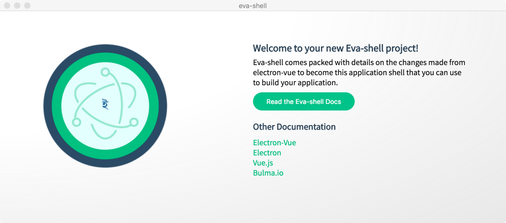
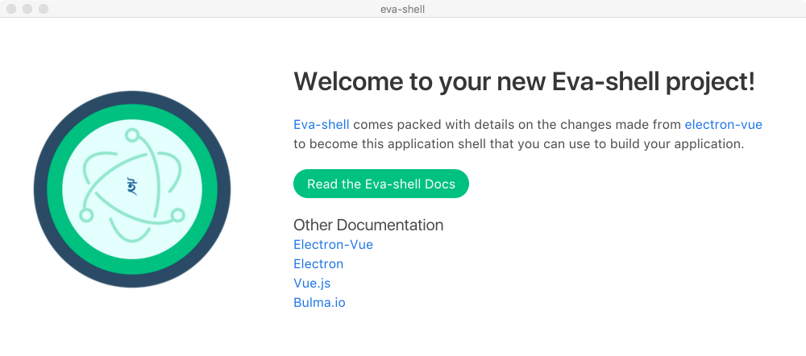

<div align="center">
  <br>
  
  <br>
  <br>
</div>

<h1 align="center">Eva-shell</h1>

<p align="center" color="#6a737d">
Electron Vue App (Eva) Shell. A "Hello World" of using VueJS & ElectronJS to build a cross-platform application shell. The boilerplate for rapidly prototyping electron applications built with Vue &amp; Bulma.io
</p>

<div align="center">

[](https://forthebadge.com)

[](http://forthebadge.com) [](https://forthebadge.com) [](http://forthebadge.com)
</div>

<div align="center">

[](https://semaphoreci.com/cpsloal/eva-shell) [](https://standardjs.com)
</div>

## Overview
While working on a startup idea with a friend, I looked at the feasibility of using Electron, Vue, and Bulma to rapidly build/prototype a cross-platform desktop application for Structural Engineers.  And we built a prototype, rapidly!  

While working on the application, it was evident the lack of tutorials/samples that had a good application layout/application shell that could be used.  And since, I am not going to share the prototype in the open (yet), I am going to show here how the prototype was rapidly built (in various functional parts, starting with Eva-Shell).

> If you like raw, unrefined sugar, check out the __Long Form Birth Certificate__ for what seems like step-by-step thought process and the birth of Eva-shell.

## Build Setup

``` bash
# install dependencies
npm install

# serve with hot reload at localhost:9080
npm run dev

# build electron application for production
npm run build

# run unit & end-to-end tests
npm test


# lint all JS/Vue component files in `src/`
npm run lint

```

Well, thats it folks.  We are done!  We can all go home now.

## Long Form Birth Certificate

> This section contains step by step of how the Eva-shell came to be (as its being built).  If a blog is written, then the link would be here and contain a more user-friendly documentation and descriptions.
>
> Check out the [commits](https://github.com/cpsloal/eva-shell/commits/master) (they have in-line comments)

### Chef's Choice (お任せ)
  1. [vue-cli](https://github.com/vuejs/vue-cli)
  1. [electron-vue](https://github.com/SimulatedGREG/electron-vue)
  1. [Bulma CSS](https://www.npmjs.com/package/bulma)
  1. [node-sass](https://www.npmjs.com/package/node-sass)


### In the beginning ...
This project was generated with [electron-vue](https://github.com/SimulatedGREG/electron-vue) using [vue-cli](https://github.com/vuejs/vue-cli). Documentation about the original structure can be found [here](https://simulatedgreg.gitbooks.io/electron-vue/content/index.html).

It is presumed that **NodeJS** is installed already.  Then from command prompt:

```
# Install vue-cli and scaffold boilerplate
npm install -g vue-cli
vue init simulatedgreg/electron-vue my-project
```

Following are the settings used when generating the project scaffolding:

>**Application Name** eva-shell
>
>**Project description** Electron Vue App (Eva) Shell. A "Hello World" of using VueJS & ElectronJS to build a cross-platform application shell.
>
>**Select which Vue plugins to install** axios, vue-electron, vue-router, vuex
>
>**Use linting with ESLint?** Yes
>
>**Which ESLint config would you like to use?** Standard
>
>**Set up unit testing with Karma + Mocha?** Yes
>
>**Set up end-to-end testing with Spectron + Mocha?** Yes
>
>**What build tool would you like to use?** builder
> 
<br>

Then ...
```
# Install dependencies and run your app
cd my-project
yarn # or npm install
yarn run dev # or npm run dev
```

Woot! we have the following load:


### Update App Icons & App package details
Now, make the app package look more like what we want. __[[see code changes](https://github.com/cpsloal/eva-shell/commit/ca797e7a6b68f29d0e2e92ce2567bd1c68082fec)]__

#### Change the Application Package details
[package.json](https://github.com/cpsloal/eva-shell/commit/ca797e7a6b68f29d0e2e92ce2567bd1c68082fec#diff-b9cfc7f2cdf78a7f4b91a753d10865a2) - "appId" used for building App package for distribution.  Check out https://www.electron.build/configuration/configuration#configuration

[/build/icons/*](https://github.com/cpsloal/eva-shell/commit/ca797e7a6b68f29d0e2e92ce2567bd1c68082fec#diff-e73c6a6466b48e909dce3e7c2e2860d0) - Add application Icons to be used by OSX/Windows/Linux.  More information [here](https://www.electron.build/icons)

#### Remove scaffolding [[see code changes](https://github.com/cpsloal/eva-shell/commit/86e93979139b70066d3ef1106ff776f1163c0445)]

Removed some scaffolding from the app folder and added sample landing page to be updated to make it look more like an app shell.  Now Eva-shell looks like:




### First step towards what looks like Eva-Shell [[see code changes](https://github.com/cpsloal/eva-shell/commit/bd16940897979ea3e0d17ac82e1ba9baf397d252)]
Lets make the app-shell have only one region for UI (the AppMain).  I.e. the following as the application layout:


And then, lets make sure it works by routing LandingPage.vue (search code for: @TAG:APPLAYOUT:LANDINGPAGE) to load in the AppMain container (search code for: @TAG:APPLAYOUT:APPMAIN).

Also, this is a good time to make sure we add SCSS/SASS and Bulma CSS to work correctly.  (search code for: @TAG:APPLAYOUT:STYLING)

TA-DA! Now we have (something that doesn't look much different) ...



By now, we have removed more boilerplate code.